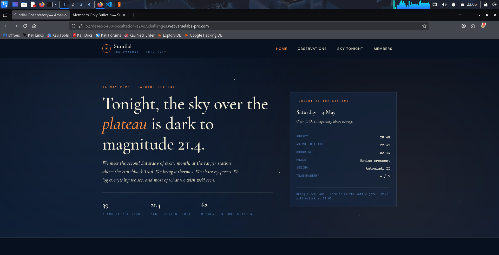

# LAB-Observatorio-del-Reloj-de-Sol
LAB-Observatorio del Reloj de Sol de WebVerse

**Contexto:**
El Observatorio del Reloj de Sol se reúne el segundo sábado de cada mes desde 1987 en una antigua estación de guardaparques reconvertida, situada sobre la meseta de Cascade.Pavel, un técnico aeroespacial jubilado, gestiona la página web desde su garaje. Le molestan las filtraciones, pero cree, por principio, que pedir amablemente a los motores de búsqueda que no indexen la página es lo mismo que mantenerla privada.

**Vulnerabilidad:**

Este desafío es principalmente una vulnerabilidad de divulgación de información.

1.iniciamos el LAB y accedemos a la web vulnerable

(Antes de seguir aclaremos algo.
¿Que es robots.txt?
Es archivo en formato de texto que oculta ciertas carpetas a los robots de busquedas, aun que mayormente se usa para guardar carpetas sencibles ejemplo /Pnale-Admin/)

2.dentro de la pagina en la URL seguido del / ponemos la siguiente ruta: robots.txt

3. en esta archivo de texto podemos ver multiples rutas  de carpetas en este LAB la solucion esta en la primera ruta (En el analizis de posibles vulnerabilidades es mejor investigar todas las carpetas posibles y a detalle)

4. Accedemos a la ruta hacemos scroll hacia bajo y ahi esta nuestra bandera

